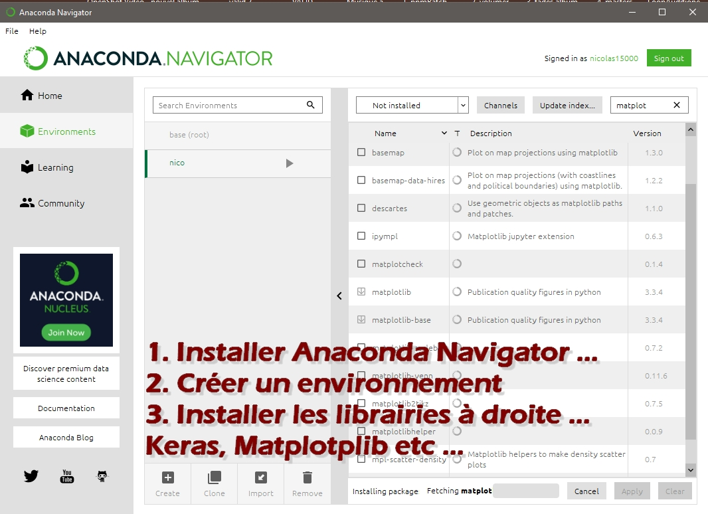

# SCRIPTS DE DATA SCIENCE PYTHON EN FRANCAIS
<b>CAS D'UTILISATIONS .</b>
 

##  Français/French

## Intro 
Je stocke ici divers scripts de data science et de mathématiques descriptives ou prédictives en Python, en langue Française. Mes études sont principalement axées sur les solveurs linéaires, les régressions multiples, les lois de probabilité et les chaines de Markov. Un peu de finances aussi... 
 <B>New 2022</b> : Je vais dorénavant stocker des centaines de fichiers de recherche opérationnelle avec le solveur EXCEL (Optimisation linéaire mathématique), traduits en Français, avec leurs légendes simplifiées ( Mélanges, Affectations multi périodes et gestion des stocks, Production avancée, Cutting stock, Bin Packing 2d et bien plus etc ..., je ne fais plus que ça .... 

## Dernières news du dépot : 

21-04-2022 : Liste provisoire des programmes linéaires du répertoire 26 ' Recherche opérationnelle avec excel '( Fichiers solveur excel provenant de sources diverses ), vivement le tri final, quand tout sera traduit , testé , trié par catégorie et validé !: 
- production mix 
- production - affectaction (Alloc) 
- production - selection de processus 
- Production - avec gestion des stocks et invendus (commerce) 
- mélange - simple période 
- mélange - multi période 
- transport 
- transport - 2-stage-transport	 
- transport -facility location 
- transport - Production Transportation Problem (2-stage-transport, multi-commodity) 					
- sac à dos (knapsac) 
- sac à dos multiple (googleOr, fichier excel à trouver) 
- découpe 1 dimension ( cuttingstock) 
- découpe 2 dimensions ( cuttingstock) 
- FlowShop 
- JobShob 
- Equilibrage de ligne d'assemblage 
- Portefeuille - investissement en portefeuille 
- Investissement 
- Projet - Minimisation de temps de projet MPM 
- Projet - Selection des meilleures tâche  
- Planification employés - (Scheduling) -  
- Affectation - Assignement  
- Affectation - Assignement simple d'employés à des tâches 
- Affectation - Assignement d'employés à des créneaux 
- Plus court chemin - Shortest past 
- Cash Flow 
- Electric engineering 
- Bin packin 1d ( fichier excel à trouver à trouver ou à créer) 
- Bin packin 2d ( fichier excel à trouver à trouver ou à créer) 

- 08-04-2022 : 26. Recherche opérationnelle en Excel - > Je prends chaque problème linéaire EXCEL , valide les résultats, puis les traduits ( Quand ce ne sont pas ceux de Christian Prins et Marc Sevaux) et ajoute des légendes. A terme, j'aurais chaque catégories de programmes linéaires parfaitement triés et susceptibles d'êtres modifiés en fonction des besoins.

- 06-04-2022 : Les fichiers 'MULTIPLES' du répertoire 'Recherche opérationnelle avec Excel' sont fantastiques avec optimisation d'affectation sur une semaine par exemple -> création de légendes et traductions.. C'est précisément ça qui est très difficile à coder en full stack (Python + Js) dans www.solvgraph.com, pourtant, en toute logique, ça doit être possible à l'avenir, mais très difficile.
L'objectif est de parvenir à programmer les 'objectifs multiples' et les 'groupes de variables de décisions' en python ( et aussi dans Excel)

- 21-03-2022 : Création du répertoire '26. Recherche opérationnelle avec Excel' pour stocker et appliquer précisement chaque catégories d'optimisations linéaires du solveur EXCEL par répertoire ( Productions , mélanges, Job Shop, flots, affectation , planification,  Bin Packing, Cutting Stock, gestion des stocks invendus) , contrôle des résultats, ajout de documentations et légendes en français dans les fichiers Excel et validations de P.ls...
- Etudes de toutes les parties du livre Programmation linéaire avec Excel - Eyrolles de Marc Sevaux et Christian Prins, avec en particulier le gestion des stocks dans les optimisations , ce que mon application www.SolvGraph.com ne fait pas encore (Car c'est très difficile à programmer en Full Stack...). Ajout d'autres fichiers Excels tirés de livres en Anglais. Je ne fais plus que ça en ce moment, pour des années ...

- 30-04-2021 : Ajout du répertoire de la théorie des files d'attente. Découverte du site de cours de mathématiques de université Lille L1 L2 et L3 : http://exo7.emath.fr/index.html

- 19-02-2021 : Création du chapitre "19. Notebooks de Data Science Kaggle, traduits en Français" , avec des stats simples, mais aussi, du Keras et du Tensorflow (Machine Learning), pour l'analyse de photos ( Exemple : détection de cancers)...

- 10-02-2021 - J'ai désormais une tablette avec des tas de livres, et j'en prends 2 ou 3 à étudier seulement(Toujours les mêmes) et retranscrit des formules en python dans ce dépot GITHUB dès que possible, triées par chapitres. Cette année c'est :

Introduction to machine learning de Andreas Muller ...chez O'reilly en Anglais : Super bien écrit et facile à comprendre.

Dunod - Mini manuel de mathématiques financières: Il contient d'excellentes bases .( Je retranscrit les formules de Maths du livre en python dans mon chapitre 5)

Mastering Python for Finance by James Ma Weiming : Livre En anglais, bien écrit et assez difficile, avec les scripts de la frontière efficace  (efficiente), du Python Pulp, etc ..

--> Mon objectif est d'utiliser dans des apps concrêtes les formules de Finances en gestion de Portfolios(Portefeuille), Les probabilités en chaines de Markov et les solveurs linéaires en programmation linéaire ( Pour mon app : http://solvgraph.com)

- 17-11-2020 - Excellent lien en Français ! : https://dridk.me/
- 17-11-2020 - Lien difficile pour les équations différentielles, en Anglais: https://apmonitor.com/pdc/index.php/Main/PhysicsBasedModels

## Notebooks de Data Science à télécharger sur Kaggle (En Anglais)!
https://www.kaggle.com/notebooks  
ting 
## Modifier les notebooks Python avec Anaconda et Jupiter : 
 
Ensuite, cliquer sur " Home " , "Jupiter Notebooks", et ouvrir ou créer un notebook...

## Pourquoi créer des notebooks Python n'est il pas suffisant ?
Parce qu'il faut aussi savoir créer des apps réelles en Full stack, puis tenter un business model quelconque , pour la vendre. Il faut donc également savoir programmer en Full Stack ( y compris du JS), en plus de faire de la Data science. Voilà pourquoi j'ai aussi des fichiers .py que je peux placer sur un serveur Flask, sur Heroku par exemple. 

## Références (Livres)

Maths : 
- "Mathématiques L1 L2 - 30 fiches" Dunod
- "Aide mémoire , Statistiques et probabilités pour l'ingénieur " Dunod
- "Mathématiques pour l'informatique" ( Version bts sio, plus courte que la version compléte ) de Dunod
- "Outils mathématiques pour l'informaticien, mathématiques discretes" De Boaeck
- "Programmation linéaire avec Excel" https://www.eyrolles.com/Informatique/Livre/programmation-lineaire-avec-excel-9782212126594/
- Livres de Maths de révision de lycées ( 2nd, Séries L, éco, S et Stg et quelques uns de collège 3 ème).
- "Mathématiques appliquées à la gestion" Pearson education ( + difficile)
- https://www.cmath.fr/

Général :
- " Visa pour la prépa " de DUNOD

Statistiques : 
- "Premiers pas en statistique" de Springer :Toutes les bases incontournables en stats : https://www.springer.com/gp/book/9782287302787

Finances:
- "Mastering Python for Finance" by James Ma Weiming
- "Mini manuel de mathématiques financières" - Dunod

Data science et ML : 
- " Big Data et Machine Learning, Manuel du Data scientist " Dunod
- " Apprendre le ML en 2 semaines" de la chaine youtube Machine Learnia
- " Data science for dummies" : La data science pour les nuls, en anglais.
- " Introduction to machine learning with python" O reilly , en anglais
- 
BI :
- " Talend for Big Data" Packt

Projets : 
- "Logistique" de Dunod , Yves Pimor"
- Lean :  " Toyota Supply Chain Management A Strategic Approach to Toyotas Renowned System" by Ananth Iyer, Sridhar Seshadri, Roy Vasher
- "Gestion de projet pour les nuls"
- " La méthode Prince 2"

Divers :
- "Maxi fiches Physique , 2 ème édition - Mécanique , Thermodynamique, Electricité, ondes , optique pour L1 et L 2 " Dunod
- " L'électronique de Poche pour les nuls"
- " La comptabilité pour les nuls"

--> Professeurs, Phd doctorants, et liens en Français :

- Le site d'un professeur de l'ENSAE: http://www.xavierdupre.fr/app/ensae_teaching_cs/helpsphinx/td_2a.html#machine-learning-les-briques-de-bases 
- Sacha Schutz : https://dridk.me/ et  https://dridk.me/equation-differentielle.html

## Infos : 
<b>Les scripts possédant la lettre C au début de leur noms ont un statut confirmé.</b> 
<b>Les scripts possédant l'attribut BASE au début de leurs noms sont les plus simples et fiables.</b> 
<b>Les scripts possédant la lettre KO au début de leurs noms ont un statut à vérifier ou en défaut.</b>
 
(Note : Confirmé, veut dire résultat bon, confirmé par comparaison, cependant, la méthode/stratégie pour obtenir le resultat n'est pas forcément encore la meilleure, les fonctions peuvent parfois être très laides.) 
 

## Librairies utilisées
* numpy 
* matplotlib 
* pandas 
* scipy 
* sklearn 
* pulp (Solvers) 
* pyschedule https://github.com/timnon/pyschedule 
* Survival regression https://lifelines.readthedocs.io/en/latest/Survival%20Regression.html#the-dataset-for-regression   

## Les Chaines Youtube Françaises:

<b>Data science, Machine Learning : </b> 
Machine Learnia https://www.youtube.com/channel/UCmpptkXu8iIFe6kfDK5o7VQ 
Nicolas Br https://www.youtube.com/channel/UCzsU0h6kxkSSCqpXTRUHubg 
Science4All : https://www.youtube.com/watch?v=Jf40Xd52NyQ  

  
<b>Maths :</b> 
Clipedia : https://www.youtube.com/channel/UCNwWU1hqK3q-DclufllWCfg 
ProMath : https://www.youtube.com/channel/UC2flwAftkypBx2gLIamxwqg 
J'ai compris Maths : https://www.youtube.com/channel/UCo-O74A4qVz6nq5cfCIee6w 
Yvan Monka : https://www.youtube.com/user/YMONKA 
Saïd Chermak : https://www.youtube.com/channel/UCppNXkk1sgDguxe8fQK9tng 

**Excellente chaine d'optimisation en Anglais ( explications très simples et structurées) :** 
https://www.youtube.com/channel/UC1S4Jeodbr5EbsCOIgBWJPQ 
Example : Les contraintes binaires en optimisation : https://www.youtube.com/watch?v=B3biWsBLeCw

<b>Liens et références (Suite)</b> 
A regarder également le super dépot Columbia-Intro-Data-Science avec tout le travail d'étudiants de Columbia dans ce domaine avec Python. 

https://github.com/Columbia-Intro-Data-Science 

Les cours sont ici :  
https://github.com/Columbia-Intro-Data-Science/APMAE4990-/tree/master/notebooks 

Un autre dépot sympa : 
https://github.com/CamDavidsonPilon/Probabilistic-Programming-and-Bayesian-Methods-for-Hackers 

- http://www.jybaudot.fr/Bourse/theoptf.html : Le site de Jy Baudot

## Ecoles :
1. S'inscrire à l'université de Brest : http://formations.univ-brest.fr/fr/index.html
2. S'inscrire à l'université de Rennes  : https://formations.univ-rennes1.fr/master-1-data-science
3. S'inscrire à l'EICNAM : http://ecole-ingenieur.cnam.fr/hors-temps-de-travail/inscription-a-l-eicnam/
4. S'inscrire à l'ENSAE : https://www.ensae.fr/auditeurs-libres/
5. S'inscrire à L'université de Bordeaux : http://www.math.u-bordeaux.fr/~mchave100p/teaching/ https://www.math.u-bordeaux.fr/imb/spip.php  
6. S'inscrire au D.U de Statistiques à Toulouse : https://www.ut-capitole.fr/formations/se-former-autrement/formation-ouverte-et-a-distance/diplome-universitaire-statistique-appliquee-formation-a-distance--326811.kjsp?RH=1319186952079

## Moocs :
Coursera  
- Programmer en Python pour la Data Science de A à Z :https://www.udemy.com/course/data-science-avec-python/ 
- Les Data Sciences de A à Z  : https://www.udemy.com/course/les-data-sciences-de-a-a-z/ 
- Spécialisation Science des données appliquée avec Python : https://fr.coursera.org/specializations/data-science-python 
- Modélisation financière : https://www.coursera.org/specializations/finance-quantitative-modeling-analysts#courses  
- real-data-science-problems : https://www.udemy.com/course/real-data-science-problems-with-python/ 
- Finances : https://www.my-mooc.com/fr/mooc/python-and-statistics-for-financial-analysis/ 

Tous les cours de programmation linéaire :  
- https://www.udemy.com/courses/search/?q=%22LINEAR%20PROGRAMMING%22&src=sac&kw=linear%20programmaing  

Moocs de Maths: 
- https://www.fun-mooc.fr/courses/course-v1:MinesTelecom+04008+session06/about  

Moocs de sciences Physique :  
- https://www.my-mooc.com/fr/categorie/physique  

##  Collabs : 
Vous désirez collaborer avec moi (Surtout sur les solveurs linéaires ( Monde agricole, productions alimentaires, production et j'espère... finance)) ... Ok ! envoyez moi un message 

 

## English
Just Some ordered python regressions, various maths and linear solvers studies scripts...

## Books
Data science for dummies :  
- https://www.amazon.fr/Python-Data-Science-Dummies-Mueller/dp/1119547628 
Python Data Science Handbook : 
- https://jakevdp.github.io/PythonDataScienceHandbook/ 

## Info 
Files with the C letter at the start of their names have confirmed status.  
Files with the KO letters at the beginning of their names have a result to check or fail.

